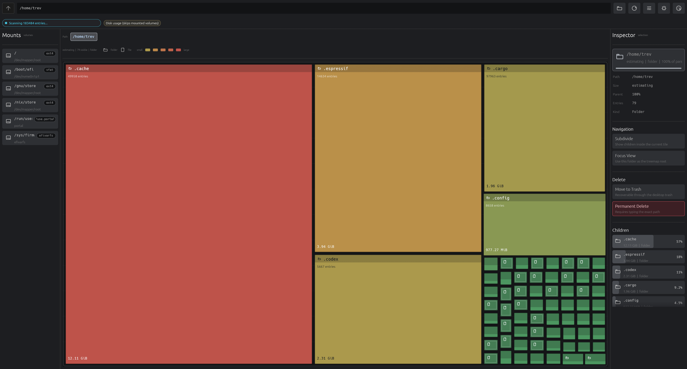

# SpaceSniffer1000

Native graphical disk space visualizer inspired by SpaceSniffer.

<p align="center">
  
</p>

## Run

```sh
guix shell -m manifest.scm -- cargo run --bin ss1000
```

Enter a path or choose a mounted filesystem, then press `Scan`. Click treemap rectangles to zoom into directories. Use breadcrumbs or `Up` to navigate back.

## Controls

- Filter visible entries by name, minimum size, and modified age.
- Toggle apparent size and cross-filesystem scans before rescanning.
- Move selected paths to trash or permanently delete them from the inspector.

Permanent delete is irreversible and requires typing the exact selected path.

## Build

```sh
guix shell -m manifest.scm -- cargo build --release
```

The release binary is `target/release/ss1000`.

The Guix package entry is `guix.scm`. It documents the remaining crate-vendoring step needed for fully offline Guix package builds.

## Screenshot


